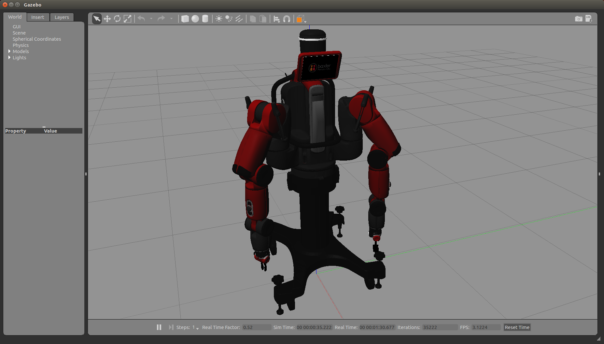
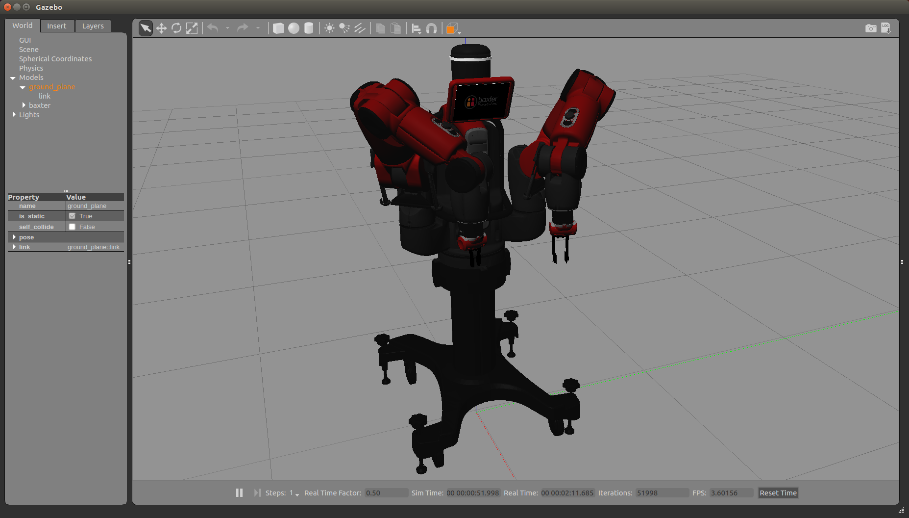
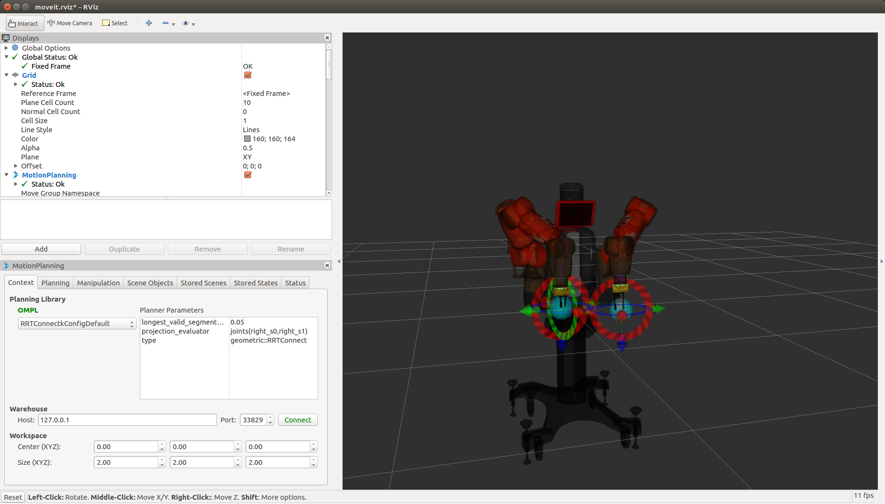
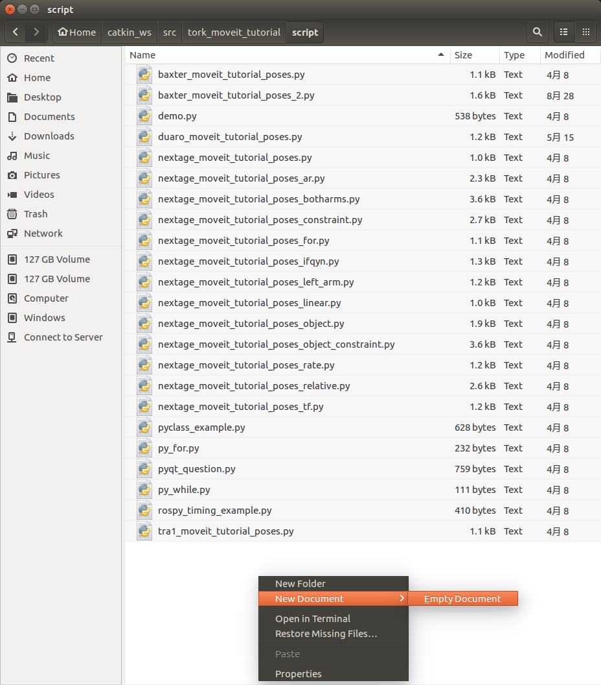

# 独自プログラムの実行

ここまでのチュートリアルでは，基本的には既存のプログラムパッケージやファイルを利用して進めてきました．

本章は Baxter Research Roobt を例に次のような作業を進めていくことで
段階的にユーザ独自のプログラムの作成・実行ができるようになることを目的としています．

- ワークスペースの作成
- ソースコードの取得とビルド
    - ソースコードの取得（=クローンなど）
    - ソースコードを実行できるようにする（=ビルド）
- ビルドしたソフトウェアの実行
- ユーザ独自プログラムの作成と実行
    - 既存プログラムの改造
    - 新規プログラムの作成


## ワークスペースの作成

ROS のプログラム開発作業ディレクトリを「ワークスペース」といいます．
独自プログラムの開発はワークスペースで行います．

- catkin の workspace を作る
  - http://wiki.ros.org/ja/catkin/Tutorials/create_a_workspace

`catkin_ws` という名前のワークスペースを作成する手順は次のとおりです．

```
$ mkdir -p ~/catkin_ws/src
$ cd ~/catkin_ws/src
$ catkin_init_workspace
$ cd ~/catkin_ws/
$ catkin_make
$ source devel/setup.bash
```

上記の `$ source devel/setup.bash` のコマンドは
ROS からワークスペースへの参照パスを設定しています．
これはワークスペースを利用する場合は新しくターミナルを立ち上げて 
ROS を使用する前に毎回必要になります．
下記のように .bashrc ファイルに設定を加えて
ターミナル起動時に setup.bash を自動で実行して
ワークスペースを利用した ROS 環境になるようにすると便利です．

```
$ echo "source ~/catkin_ws/devel/setup.bash" >> ~/.bashrc
```

- **注意** : 上記コマンドの `>>` を `>` にしてしまうと
  元々あった .bashrc 内の設定が消えてしまうので気をつけてください．

.bashrc の設定ができていると以後のターミナルを起動するたびに行う
`source ~/catkin_ws/devel/setup.bash` は不要です．

ROS 環境の確認は次のコマンドを入力して行うことができます．

```
$ env | grep ROS
```

下記は ROS 環境を表示した例です．
`ROS_PACKAGE_PATH` にワークスペースのディレクトリ 
`/home/robotuser/catkin_ws/src` があることで，
ROS のシステムからワークスペース内のパッケージにある実行ファイルなどを
参照することができるようになっています．

```
robotuser@robotuser-PC:~/catkin_ws$ env | grep ROS
ROS_ROOT=/opt/ros/kinetic/share/ros
ROS_PACKAGE_PATH=/home/robotuser/catkin_ws/src:/opt/ros/kinetic/share
ROS_MASTER_URI=http://localhost:11311
ROS_VERSION=1
ROSLISP_PACKAGE_DIRECTORIES=/home/robotuser/catkin_ws/devel/share/common-lisp
ROS_DISTRO=kinetic
ROS_ETC_DIR=/opt/ros/kinetic/etc/ros
```

**ワークスペース名について**  

ワークスペース名は基本的に半角英数字であれば何でも大丈夫です．

本チュートリアルに限らず多くのチュートリアルでは 
`catkin_ws` や `ros_ws` といったワークスペース名が多く使われています．
しかし，いろいろな種類のロボットやセンサなどのプログラムを書いていると
ワークスペースを分けたくなることもあります．

発展的に独自プログラムを作成する際に新たにワークペースを追加する場合は
他のワークスペース名と重複しないワークスペース名をつけてください．

例えば，上で `catkin_ws` としたところを 
Baxter Research Robot を扱うということで
`baxter_ws` や `brr_ws` といったワークスペース名としてみるのも良いでしょう．


## ソースコードの取得とビルド

前節で作成したワークスペースに既存の ROS パッケージをネットワークを介して 
Ubuntu PC 上のワークスペースにコピー（クローン）して，
それをビルドすることでプログラムを実行できる状態にします．

クローンとビルドを行う ROS パッケージは 
Baxter Research Robot の下記のパッケージです．

- Baxter Research Robot
    - Software Development Kit (SDK)
    - Baxter MoveIt! Configuration Package
    - Baxter Simulator

### Baxter Software Development Kit の取得とビルド

次の手順で Baxter Software Development Kit のクローンと
それに必要なソフトウェアパッケージの取得，ビルドを行います．

```
$ cd ~/catkin_ws/src
$ git clone https://github.com/RethinkRobotics/baxter.git
$ cd ~/catkin_ws/src/baxter
$ git checkout master
$ cd ~/catkin_ws
$ wstool init src
$ wstool merge -t src ~/catkin_ws/src/baxter/baxter_sdk.rosinstall
$ wstool update -t src
$ rosdep install -y -r --from-paths src --ignore-src
$ catkin_make
$ source devel/setup.bash
```

### Baxter MoveIt! Configuration の取得とビルド

次の手順で Baxter MoveIt! Configuration のクローンと
それに必要なソフトウェアパッケージの取得，ビルドを行います．

```
$ cd ~/catkin_ws/src
$ git clone https://github.com/ros-planning/moveit_robots.git
$ cd ~/catkin_ws/src/moveit_robots
$ git checkout <$ROS_DISTRO>-devel
$ cd ~/catkin_ws
$ rosdep install -y -r --from-paths src --ignore-src
$ catkin_make
$ source devel/setup.bash
```

### Baxter Simulator の取得とビルド

次の手順で Baxter Simulator のクローンと
それに必要なソフトウェアパッケージの取得，ビルドを行います．

```
$ sudo apt-get install gazebo7 ros-kinetic-qt-build ros-kinetic-gazebo-ros-control ros-kinetic-gazebo-ros-pkgs ros-kinetic-ros-control ros-kinetic-control-toolbox ros-kinetic-realtime-tools ros-kinetic-ros-controllers ros-kinetic-xacro python-wstool ros-kinetic-tf-conversions ros-kinetic-kdl-parser
$ cd ~/catkin_ws
$ wstool merge -t src https://raw.githubusercontent.com/RethinkRobotics/baxter_simulator/kinetic-devel/baxter_simulator.rosinstall
$ wstool update -t src
$ rosdep install -y -r --from-paths src --ignore-src
$ catkin_make
$ source devel/setup.bash
```

## ビルドしたソフトウェアの実行

前節のソフトウェアコードの取得とビルドがエラーなく進んでいれば
この時点でそれらのソフトウェアを実行できる状態になっているはずです．

ビルドできていれば基本的に `sudo apt-get install ...` でインストールした 
ROS パッケージと同じ要領でソフトウェアを実行することができます．
唯一違うのはソフトウェアをビルドしたワークスペースにも 
ROS 環境のパッケージパスを通すという点です．

```
$ source ~/catkin_ws/devel/setup.bash
```

これはワークスペースの作成のところで記述したように
ターミナルを起動するたびに行われる必要があります．
毎回 ROS の環境設定を行うのが面倒な場合は .bashrc ファイルを編集して
ターミナルを起動するたびに自動的に実行されるようにしてください．
（参照: ワークスペースの作成）

Baxter Simulator 上の Baxter ロボットを MoveIt! から動かすために
ターミナルを4つ開き，それぞれで次のことを行います．

- ターミナル-1 : Baxter Gazebo シミュレータの実行
- ターミナル-2 : Baxter ロボットの初期化とインタフェースの起動
- ターミナル-3 : Baxter MoveIt! の実行
- ターミナル-4 : Baxter MoveIt! プログラムの実行

### Gazebo シミュレータの実行

Baxter Research Robot の Gazebo シミュレータを起動します．
1つ目のターミナル上で次のコマンドを実行してください．


**ターミナル-1** : Baxter Gazebo シミュレータの実行
```
$ source ~/catkin_ws/devel/setup.bash
$ roslaunch baxter_gazebo baxter_world.launch  
```



しばらくすると次のようなメッセージが **ターミナル-1** に表示されます．

```
[ INFO] [1509004453.402952141, 10.130000000]: Simulator is loaded and started successfully
[ INFO] [1509004453.462744480, 10.140000000]: Robot is disabled
[ INFO] [1509004453.462870807, 10.140000000]: Gravity compensation was turned off
```

これで Gazebo シミュレータの起動は完了した状態になっています．

### ロボットの初期化とインタフェースの起動

次に Baxter Research Robot を MoveIt! から操作可能な状態になるように準備を行います．
2つ目のターミナル上で次のコマンドを実行してください．

**ターミナル-2** : ロボットの初期化とインタフェースの起動
```
$ source ~/catkin_ws/devel/setup.bash
$ rosrun baxter_tools enable_robot.py -e

[INFO] [WallTime: 1509004993.657452] [192.385000] Robot Enabled

$ rosrun baxter_tools tuck_arms.py -u

[INFO] [WallTime: 1509005020.475291] [0.000000] Untucking arms
[INFO] [WallTime: 1509005020.910480] [202.807000] Moving head to neutral position
[INFO] [WallTime: 1509005020.911446] [202.808000] Untucking: Arms already Untucked; Moving to neutral position.
[INFO] [WallTime: 1509005024.476011] [204.036000] Finished tuck

$ rosrun baxter_interface joint_trajectory_action_server.py

Initializing node...
Initializing joint trajectory action server...
Running. Ctrl-c to quit
```



これでロボットの準備は完了です．

### MoveIt! の起動

3つ目のターミナルで次のコマンドを実行して MoveIt! を起動します．

**ターミナル-3** : MoveIt! の起動
```
$ source ~/catkin_ws/devel/setup.bash
$ roslaunch baxter_moveit_config baxter_grippers.launch
```



これで MoveIt! の動作計画機能が利用できる状態になっています．

これまでのチュートリアルで行ったのと同様に MoveIt! の GUI から動作生成と実行を試してみてください．

### プログラムの実行

Baxter を MoveIt! の GUI から動作生成とその実行をすることができましたら，
他のロボットで行った場合と同じように動作プログラムを実行してみます．

4つ目のターミナルで次のコマンドを入力してプログラムを実行します．

**ターミナル-4** : ロボット動作プログラムの実行
```
$ rosrun tork_moveit_tutorial baxter_moveit_tutorial_poses.py
```

右腕が2つの姿勢をとる動作が実行されたかと思います．


## ユーザ独自プログラム作成と実行

これまでは既存のプログラムを利用してチュートリアルを進めてきました．
次はまずユーザ独自のプログラムを作成して実行するための足がかりとして，
本チュートリアルのソースコードを取得して Baxter Research Robot 
の動作プログラムの改造を行ってみます．

### チュートリアルソースコードの取得とビルド

次の手順で TORK MoveIt! Tutorial パッケージのクローンと
それに必要なソフトウェアパッケージの取得，ビルドを行います．

```
$ cd ~/catkin_ws/src
$ git clone https://github.com/tork-a/tork_moveit_tutorial.git
$ cd ~/catkin_ws
$ rosdep install -y -r --from-paths src --ignore-src
$ catkin_make
$ source ~/catkin_ws/devel/setup.bash
```

### 現在利用しているパッケージの確認

本チュートリアルをはじめから進めてきた場合は 
TORK MoveIt! Tutorial パッケージを最初にインストールしているはずです．
その上で新たに TORK MoveIt! Tutorial パッケージを取得してビルドしました．
つまり2つの TORK MoveIt! Tutorial パッケージが Ubuntu PC 上に存在しています．

ここで使いたいのはワークスーペース内に取得，ビルドした `tork_moveit_tutorial` なのですが，
現在どちらの `tork_moveit_tutorial` が使われているのか確認するには 
`rospack find` を使う方法があります．

```
$ rospack find tork_moveit_tutorial
```

- ワークスペース内の `tork_moveit_tutorial` が **参照されている** 場合
    （パッケージの取得とビルドを行った方を参照）
    ```
    robotuser@robotuser-PC:~/catkin_ws$ rospack find tork_moveit_tutorial 
    /home/robotuser/catkin_ws/src/tork_moveit_tutorial
    ```
- ワークスペース内の `tork_moveit_tutorial` が **参照されていない** 場合
    （元々インストールされているパッケージの方を参照）
    ```
    robotuser@robotuser-PC:~/catkin_ws$ rospack find tork_moveit_tutorial 
    /opt/ros/<$ROS_DISTRO>/share/tork_moveit_tutorial
    ```

ここではワークスペース内の `tork_moveit_tutorial` のプログラムを改造して実行したいので
ワークスペース内の `tork_moveit_tutorial` を参照しているようになっていて欲しいのですが，
そうなっていない場合は ROS 環境設定でワークスペースへの
ディレクトリパスが設定されていない原因が考えられます．
ワークスペース内のセットアップ `setup.bash` を実行して ROS 環境設定を行ってください．

```
$ source ~/catkin_ws/devel/setup.bash
```

ROS 環境設定を実行しましたら再度 `rospack find tork_moveit_tutorial` や
`env | grep ROS` などで ROS 環境の確認をしてみてください．


### 既存プログラムの改造

本チュートリアルのプログラムは `tork_moveit_tutorial` 内の 
`/script` フォルダ内にあります．

```
robotuser@robotuser-PC:~/catkin_ws$ ls ~/catkin_ws/src/tork_moveit_tutorial/script
baxter_moveit_tutorial_poses.py                     nextage_moveit_tutorial_poses_object.py
demo.py                                             nextage_moveit_tutorial_poses.py
duaro_moveit_tutorial_poses.py                      nextage_moveit_tutorial_poses_rate.py
nextage_moveit_tutorial_poses_ar.py                 nextage_moveit_tutorial_poses_relative.py
nextage_moveit_tutorial_poses_botharms.py           nextage_moveit_tutorial_poses_tf.py
nextage_moveit_tutorial_poses_constraint.py         pyclass_example.py
nextage_moveit_tutorial_poses_for.py                py_for.py
nextage_moveit_tutorial_poses_ifqyn.py              pyqt_question.py
nextage_moveit_tutorial_poses_left_arm.py           py_while.py
nextage_moveit_tutorial_poses_linear.py             rospy_timing_example.py
nextage_moveit_tutorial_poses_object_constraint.py  tra1_moveit_tutorial_poses.py
```

ここでは Baxter Research Robot の動作プログラム `baxter_moveit_tutorial_poses.py` 
を同じフォルダ内に複製して `baxter_moveit_tutorial_poses_2.py` と名前を変更して
手先姿勢動作を追加する改造を行います．

まずはプログラムファイルのコピーをします．
Ubuntu の Files でコピー＆ペースト＋名前の変更で行っても良いですし，
下記のように `cp` コピーコマンドでコピーしても良いです．

```
$ cd ~/catkin_ws/src/tork_moveit_tutorial/script
$ cp baxter_moveit_tutorial_poses.py baxter_moveit_tutorial_poses_2.py 
```

プログラムをコピーしただけなのでコピー元のプログラムと同様に実行できるはずなので確認してみます．
次の ターミナル-1〜3 は既に実行済でしたら改めて実行する必要はありませんので，
ターミナル-4 でコピーしたプログラムを実行します．

**ターミナル-1** : Baxter Gazebo シミュレータの実行
```
$ source ~/catkin_ws/devel/setup.bash
$ roslaunch baxter_gazebo baxter_world.launch  
```

**ターミナル-2** : ロボットの初期化とインタフェースの起動
```
$ source ~/catkin_ws/devel/setup.bash
$ rosrun baxter_tools enable_robot.py -e
$ rosrun baxter_tools tuck_arms.py -u
$ rosrun baxter_interface joint_trajectory_action_server.py
```

**ターミナル-3** : MoveIt! の起動
```
$ source ~/catkin_ws/devel/setup.bash
$ roslaunch baxter_moveit_config baxter_grippers.launch
```

**ターミナル-4** : ロボット動作プログラムの実行
```
$ source ~/catkin_ws/devel/setup.bash
$ rosrun tork_moveit_tutorial baxter_moveit_tutorial_poses_2.py
```

元のプログラム `baxter_moveit_tutorial_poses.py` と同様の手先姿勢の動作を行ったかと思います．

それでは動作プログラムの `baxter_moveit_tutorial_poses_2.py` を改造してみます．

テキストエディタで `baxter_moveit_tutorial_poses_2.py` を開いて編集します．
テキストエディタは Ubuntu にデフォルトでインストールされている gedit や
他のテキストエディタでも大丈夫です．

ターミナルから gedit を起動する場合は次のように実行します．

```
$ gedit baxter_moveit_tutorial_poses_2.py
```

**baxter_moveit_tutorial_poses_2.py** （コピー直後）
```python
#!/usr/bin/env python

from tork_moveit_tutorial import *


if __name__ == '__main__':
    
    init_node()
    
    group = MoveGroupCommander("right_arm")
    
    # Pose Target 1
    rospy.loginfo( "Start Pose Target 1")
    pose_target_1 = Pose()
    
    pose_target_1.position.x = 0.7
    pose_target_1.position.y = -0.2
    pose_target_1.position.z = 0.1
    pose_target_1.orientation.x = 0.0
    pose_target_1.orientation.y = 1.0
    pose_target_1.orientation.z = 0.0
    pose_target_1.orientation.w = 0.0
    
    rospy.loginfo( "Set Target to Pose:\n{}".format( pose_target_1 ) )
    group.set_pose_target( pose_target_1 )
    group.go()
    
    # Pose Target 2
    rospy.loginfo( "Start Pose Target 2")
    pose_target_2 = Pose()
    
    pose_target_2.position.x = 0.9
    pose_target_2.position.y = -0.3
    pose_target_2.position.z = 0.6
    pose_target_2.orientation.y = 0.707
    pose_target_2.orientation.w = 0.707
        
    rospy.loginfo( "Set Target to Pose:\n{}".format( pose_target_2 ) )
    group.set_pose_target( pose_target_2 )
    group.go()
    
    
```

`baxter_moveit_tutorial_poses_2.py` に次の2つの目標姿勢への動作を加えてみます．

- 動作 3
    - `pose_target_1` に戻る
- 動作 4
    - 手先位置 `[ -0.5, -0.7, 0.1 ]` に移動する
    - 姿勢は `pose_target_1` と同じ

動作 3 と 4 の部分をプログラムに置き換えると次のようになります．

```python
    # Pose Target 3
    group.set_pose_target( pose_target_1 )
    group.go()
    
    # Pose Target 4
    pose_target_4 = Pose()
    
    pose_target_4.position.x = -0.5
    pose_target_4.position.y = -0.7
    pose_target_4.position.z = 0.1
    pose_target_4.orientation.x = pose_target_1.orientation.x
    pose_target_4.orientation.y = pose_target_1.orientation.y
    pose_target_4.orientation.z = pose_target_1.orientation.z
    pose_target_4.orientation.w = pose_target_1.orientation.w
    
    group.set_pose_target( pose_target_4 )
    group.go()
    
```

`# Pose Target 3` と `# Pose Target 4` のように `#` がある行は 
`#` 以降が "コメント" 扱いとなりプログラムとしては実行されません．
プログラムが何を行っているのかを自分が後から読んだり，
他の人が読んだりしたときに分かりやすいように適宜書き入れると良いでしょう．

動作 3 と 4 の部分を元の `baxter_moveit_tutorial_poses_2.py` に加えた
全体のプログラムは次のようになります．

```python
#!/usr/bin/env python

from tork_moveit_tutorial import *


if __name__ == '__main__':
    
    init_node()
    
    group = MoveGroupCommander("right_arm")
    
    # Pose Target 1
    rospy.loginfo( "Start Pose Target 1")
    pose_target_1 = Pose()
    
    pose_target_1.position.x = 0.7
    pose_target_1.position.y = -0.2
    pose_target_1.position.z = 0.1
    pose_target_1.orientation.x = 0.0
    pose_target_1.orientation.y = 1.0
    pose_target_1.orientation.z = 0.0
    pose_target_1.orientation.w = 0.0
    
    rospy.loginfo( "Set Target to Pose:\n{}".format( pose_target_1 ) )
    group.set_pose_target( pose_target_1 )
    group.go()
    
    # Pose Target 2
    rospy.loginfo( "Start Pose Target 2")
    pose_target_2 = Pose()
    
    pose_target_2.position.x = 0.9
    pose_target_2.position.y = -0.3
    pose_target_2.position.z = 0.6
    pose_target_2.orientation.y = 0.707
    pose_target_2.orientation.w = 0.707
    
    rospy.loginfo( "Set Target to Pose:\n{}".format( pose_target_2 ) )
    group.set_pose_target( pose_target_2 )
    group.go()
    
    # Pose Target 3
    group.set_pose_target( pose_target_1 )
    group.go()
    
    # Pose Target 4
    pose_target_4 = Pose()
    
    pose_target_4.position.x = -0.5
    pose_target_4.position.y = -0.7
    pose_target_4.position.z = 0.1
    pose_target_4.orientation.x = pose_target_1.orientation.x
    pose_target_4.orientation.y = pose_target_1.orientation.y
    pose_target_4.orientation.z = pose_target_1.orientation.z
    pose_target_4.orientation.w = pose_target_1.orientation.w
    
    group.set_pose_target( pose_target_4 )
    group.go()
    
```

ここで注意しないといけないのがプログラムの各行の "**インデント**（字下げ）" です．
本チュートリアルではプログラミング言語に Python を使っています．
Python はプログラムのまとまりをインデントの揃いで判断しています．
インデント字数とプログラムのまとまりの関係を適切に設定しないと
意図と違った動作をプログラムが行ってしまうことがあります．

動作 3 と 4 を加えた `baxter_moveit_tutorial_poses_2.py` を保存してください．
保存したらプログラムを実行します．

**ターミナル-4** : 改造したロボット動作プログラムの実行
```
$ source ~/catkin_ws/devel/setup.bash
$ rosrun tork_moveit_tutorial baxter_moveit_tutorial_poses_2.py
```

動作 3 と 4 を加えた動作を Baxter Research Robot にて実行されたかと思います．


### 新規プログラムの作成

前項では既存のプログラムを複製して改造を行いました．
本項では新規ファイルとしてプログラムを作成して実行してみます．

`~/catkin_ws/src/tork_moveit_tutorial/script` フォルダ内に
新しいファイル `baxter_moveit_tutorial_poses_3.py` を作成します．

Ubuntu の Files の `~/catkin_ws/src/tork_moveit_tutorial/script` 
フォルダ内の空白部分で右クリックすると，設定言語にもよりますが 
New Document → Empty Document といったメニューがありますのでそれをクリックし，
ファイル名 `baxter_moveit_tutorial_poses_3.py` を入力して新規ファイルを作成します．



`baxter_moveit_tutorial_poses_3.py` は何も中身のないファイルですので，
ここでは `baxter_moveit_tutorial_poses_2.py` の内容をそのままコピーしてみます．

テキストエディタで `baxter_moveit_tutorial_poses_3.py` と
`baxter_moveit_tutorial_poses_2.py` を両方開いて
`baxter_moveit_tutorial_poses_2.py` のプログラムを全て選択，コピーして
`baxter_moveit_tutorial_poses_3.py` にペーストしてください．

新規作成したファイルには 
`baxter_moveit_tutorial_poses_3.py` というプログラムらしい名前をつけましたが
このままでは普通のテキストファイルなのでプログラムファイルとして実行できない状態にあります．
プログラムファイルとして実行できるようにするためにはファイルの実行権限設定を行う必要があります．

ファイルの実行権限の状態を調べるには `ls -l` というコマンドを使います．

- `cd` コマンドで `~/catkin_ws/src/tork_moveit_tutorial/script/` ディレクトリに移動
- `ls -l` コマンドを実行
    - `grep` コマンドを付加してファイル名に `baxter` を含むものだけを表示

```
$ cd ~/catkin_ws/src/tork_moveit_tutorial/script/
$ ls -l | grep baxter
-rwxrwxr-x 1 robotuser robotuser 1631  8月 28 16:33 baxter_moveit_tutorial_poses_2.py
-rw-rw-r-- 1 robotuser robotuser    0  9月  4 14:42 baxter_moveit_tutorial_poses_3.py
-rwxrwxr-x 1 robotuser robotuser 1081  4月  8 16:34 baxter_moveit_tutorial_poses.py
```

`ls -l` の出力の一番左にある `-rwxrwxr-x ` のように 
`x` が出力されいているファイルが実行権限があるファイルです．
`baxter_moveit_tutorial_poses_2.py` には `x` が3つ出力されているので
「ユーザ」「グループ」「その他」の全てにおいて実行権限がありますが，
`baxter_moveit_tutorial_poses_3.py` には `x` が1つも出力されていないので
全く実行権限がありません．

ファイルに実行権限を付与するには `chmod` コマンドを使います．
今回は `chmod` のオプションを次のように設定して
ユーザ，グループ，その他の全てに対して実行権限を付与します．

- a: ユーザ，グループ，その他の全て
- x: 実行権限

```
$ chmod a+x baxter_moveit_tutorial_poses_3.py
```

もう一度 `~/catkin_ws/src/tork_moveit_tutorial/script/` ディレクトリで
`ls -l | grep baxter` を実行してファイルの実行権限の状態を見てみます．

```
$ ls -l | grep baxter
-rwxrwxr-x 1 robotuser robotuser 1631  8月 28 16:33 baxter_moveit_tutorial_poses_2.py
-rwxrwxr-x 1 robotuser robotuser    0  9月  4 14:42 baxter_moveit_tutorial_poses_3.py
-rwxrwxr-x 1 robotuser robotuser 1081  4月  8 16:34 baxter_moveit_tutorial_poses.py
```

`baxter_moveit_tutorial_poses_3.py` に他のプログラムファイルと同様の
実行権限となったことが見てとれるかと思います．

`baxter_moveit_tutorial_poses_3.py` の実行をします．

**ターミナル-4** : 新規作成したロボット動作プログラムファイルの実行
```
$ source ~/catkin_ws/devel/setup.bash
$ rosrun tork_moveit_tutorial baxter_moveit_tutorial_poses_3.py
```

`baxter_moveit_tutorial_poses_3.py` が 
`baxter_moveit_tutorial_poses_2.py` と同様に実行されたかと思います．


